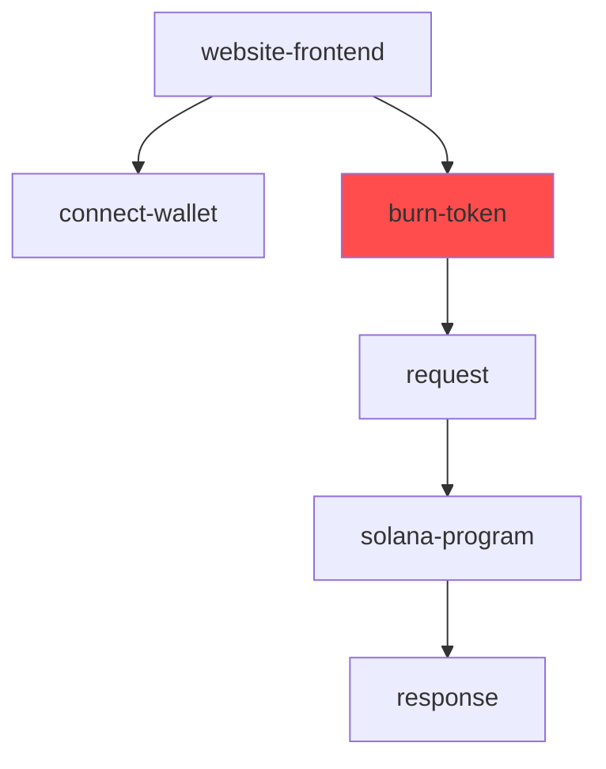

# smartexplorer

Solana program that responds to normal queries for block and tx details, automatically assign labels to some transactions, create graphs and analysis, create alerts based on activity on chain, include p2p network and scrapes social media for solana transactions, projects and related things.

